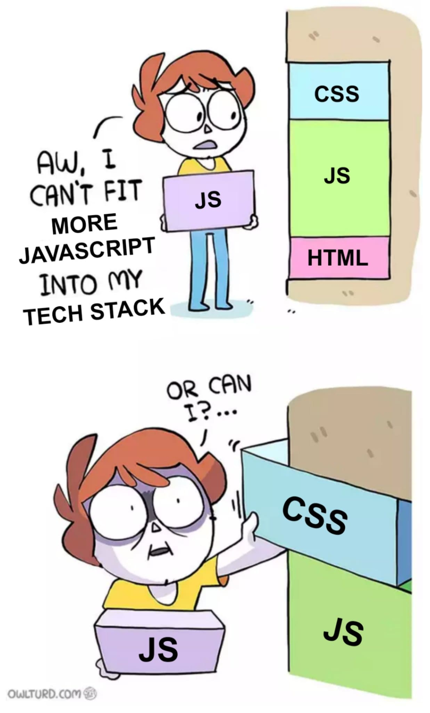

# A React App

There's plenty of good documentation in the classic and beta docs:

- Classic: https://reactjs.org/docs/getting-started.html
- Beta: https://beta.reactjs.org/

It is probably a good idea to give preference, and invest time on the
beta docs.

## JSX

An extension to JavaScript, so that we can represent objects using an
XML like syntax.

```jsx
const element = <h1 title="foo">Hello</h1>;

const container = document.getElementBy("root");

ReactDOM.render(element, container);
```

When a file containing JSX is parsed, the parser replaces the JSX with a JavaScript
object.

It is actually possible, albeit perhaps useless, to control how JSX is replaced with
objects, by defining a jsx pragma. The default pragma is, usually, `React.createElement`.

Without JSX we would write:

```js
const About = () => {
  return createElement(
    Fragment,
    null,
    createElement(
      "head",
      null,
      createElement("title", null, "About"),
      createElement("meta", { name: "name", content: "meta tag content" })
    ),
    createElement("div", null, createElement("h1", null, "Hello world"))
  );
};
```

- https://codesandbox.io/s/friendly-nash-wgk7x?file=/src/Reactive.js
- https://dev.to/ryansolid/jsx-is-not-hyperscript-61i
- https://egghead.io/learn/react/beginners/wtf-is-jsx

## Elements and Components

A React element:

```jsx
const element = <p>lorem ipsum</p>;
```

A React component:

```jsx
const App = () => <div>Million dollar app!</div>;
```

> We never really call `App()`, rather we say `<App />`

## Rendering, and Browser paint

When React does a so called render, it calls the function that describes
the UI associated with a component, where the change has happened.

> A React app re-renders because state has changed, somewhere. In React 18
> there's an exception to this with external stores.

Calling the function gives React an element, which is just a JavaScript
object, that is then used to "reconciliate" the UI.

Where a change is observed, fine grained mutations are executed. Once all of the
React work is done, the browser paint kicks in.

Not all React renders, lead to browser paints.

### The Loop

#### Mount

There's no current description of the UI associated with this component.
React does all of the work to append this UI into the DOM.

#### State Change

React is notified of a state change, typically because a state setter, or
reducer dispatch function is called.

#### Render

Because state, somewhere, has changed, React starts at the place were state
was changed, and from there starts to generate a new description of the UI.

This description is compared with the current UI.

#### Commit

If there's any changes that require changes to the DOM, React executes them.

- https://web.dev/rendering-performance/#the-pixel-pipeline

### MVC?

React came out of Facebook's need to scale quickly. When it was open sourced
the community rejected it. The ads platform, messenger, Instagram, are all
billion dollar projects that rode the React wave.

What was the problem with the MVC frameworks of the age? They relied on
on mutable shared state, and to be consistent, did computationally expensive
checks, and validations.

Well that React was the living proof that mutable shared state was not as
fast as an immutable approach.

This goes hand in hand with the progress made in JavaScript engines. Initially
the Facebook open source team was not very good at selling React, and it was hated.

However, as they studied what they had actually done, and talked to people from
outside the Facebook organization, they saw they had made a functional UI framework.

We as developers work with immutable data, heavily using reference equality,
React does all of the dirty DOM mutations to reconcile state with what's painted
in the browser.

It was easy to attack this idea, by saying that abusing references, and working
with immutable data structures, would be slow because of garbage collection,
or it would eat up more RAM than needed.

When compared with Backbone.js and other MVCs of the time, React and other tools
build on top, or forked from React, were always faster. Even when MVCs apps were
optimized by developers, an out of the box React app did better.

The battle is still raging though.

## Classes, HoCs and Render Props

Originally, React used classes, because the concept of a class leans
more naturally into extending React's core capabilities into your business
logic.

Developers loved to use Classes to create Higher Order Components, which
take up the responsibility of managing data, while allowing others to
focus on just presentation.

```jsx
const withGitHub = (Component) => {
  class WithGitHubData extends React.Component {
    state = { github: null };

    componentDidMount() {
      fetchGitHubData().then((data) => this.setState(data));
    }

    render() {
      if (!github) return <div>Loading...</div>;

      return <Component {...this.props} github={github} />;
    }
  }

  return WithGitHubData;
};

const Profile = ({ title, github }) => <h1 title={title}>{github.login}</h1>;

const GitHubProfile = withGitHub(Profile);

const App = () => (
  <main>
    <GitHubProfile title="Dev" />
  </main>
);
```

However, sharing business logic with classes was not trivial.

- It required us to wrap the the entire target component

So, we came up with Render Props.

> Functions as children!

```jsx
class RenderWithGitHub extends React.Component {
  state = { github: null };

  componentDidMount() {
    fetchGitHubData().then((data) => this.setState(data));
  }

  render() {
    if (!github) return <div>Loading...</div>;

    return this.props.children({ github });
  }
}

const App = () => (
  <main>
    <RenderWithGitHub>
      {({ github }) => <GitHubProfile title="Dev" github={github} />}
    </RenderWithGitHub>
  </main>
);
```

HoCs were great, but required us to wrap an entire component to be able
to inject our logic.

```js
export default withAuth(withUser(withOrders(MyPage)));
```

Render Props could target specific parts of the JSX, but created
complexity as soon as more than one behavior had to be reused.

```jsx
<RenderWithAuth>
  {({ auth }) => (
    <RenderWithGitHub auth={auth}>
      {({ github }) => <GitHubProfile title="Dev" github={github} />}
    </RenderWithGitHub>
  )}
</RenderWithAuth>
```

Anything that can be made with HoCs, can be made with Render props, and
in turn, those things can be made with Hooks.

## Hooks

Today we use Hooks.

Hooks only work in Function components.

They are literally a hook into React's core, which allows us to describe
the UI, and let React figure out what state applies to a given component
instance at any given time.

> Default function parameters! https://developer.mozilla.org/en-US/docs/Web/JavaScript/Reference/Functions/Default_parameters

```jsx
const useCounter = (initial = 0) => {
  const [value, setValue] = useState(initial);
  const inc = () => setValue((prev) => prev + 1);
  const dec = () => setValue((prev) => prev - 1);

  return { count: value, inc, dec };
};

const RenderWithCount = ({ initial = 0, children }) => {
  const { count, inc, dec } = useCounter(0);

  return children({ count, inc, dec });
};

const WithCount = (Component) => {
  const Enhanced = (props) => {
    return (
      <RenderWithCount>
        {(countState) => <Component {...props} {...countState} />}
      </RenderWithCount>
    );
  };

  return Enhanced;
};

// or
const WithCount = (Component) => {
  const Enhanced = (props) => {
    const countState = useCounter(props.initial);
    return <Component {...props} {...countState} />;
  };

  return Enhanced;
};
```

> https://usehooks.com/

## Components

A component is a way to hide implementation details.

Think of a Button component:

```jsx
<Button className="btn" />

<Button className="btn btn--primary" />

<Button type="disabled" className="btn btn--disabled" />
```

All of these attributes are implementation details. They are only
important for the producer of this component.

As the consumer of a component:

```jsx
<Button />
<Button variant="primary" />
<Button disabled />
```

As the user of a component, the type, class name are details
that have less importance, the value of a component is that
it behaves as your design system defines it.

The implementation might switch to use `float`, `flex`, `grid`,
for the user of a component it shouldn't matter.

> Instead of re-using class names through out the app,
> we want to re-use components

- My humble take on modern CSS: https://github.com/icyJoseph/css-lightning-talk

## Can we see what's React really doing?

- https://codesandbox.io/s/currying-morning-m1oop

## Exercise

### Search Dogs

This site has a nice search component:

- https://dog.ceo/dog-api/breeds-list

Let's try to re-implement the missing parts.

1. Get the list of dogs for the selector
2. On `Fetch!`, replace the dog image
3. If no breed is selected, disable the button
4. Let's talk about cancelling async work

#### How to fetch data?

```jsx
import { useState, useEffect } from 'react';
import { fetchBio } from './api.js';

export default function Page() {
  const [person, setPerson] = useState('Alice');
  const [bio, setBio] = useState(null);

  useEffect(() => {
    let ignore = false;
    setBio(null);
    fetchBio(person).then(result => {
      if (!ignore) {
        setBio(result);
      }
    });
    return () => {
      ignore = true;
    };
  }, [person]);

  // ...
```

#### How to work with inputs in React?

- https://www.joshwcomeau.com/react/data-binding/

Snippet taken from: https://www.joshwcomeau.com/react/data-binding/#select-12

```jsx
import { useState } from "react";

function App() {
  const [age, setAge] = useState("0-18");

  return (
    <>
      <form>
        <label htmlFor="age-select">How old are you?</label>

        <select
          id="age-select"
          value={age}
          onChange={(event) => {
            setAge(event.target.value);
          }}
        >
          <option value="0-18">18 and under</option>
          <option value="19-39">19 to 39</option>
          <option value="40-64">40 to 64</option>
          <option value="65-infinity">65 and over</option>
        </select>
      </form>

      <p>
        <strong>Selected value:</strong>
        {age}
      </p>
    </>
  );
}

export default App;
```

### Card component

Given two components that share some similarities, create
a common component called Card, which collects some of these
similarities.

#### Styled Components

A CSS-in-JS solution. Together with emotion, these are probably the most
used in production deploys.

The idea is to bind the styling to the component, be it an HTML tag, or
a React Component.

This way we:

- Scoped CSS
- Get rid of the need to map CSS-to-HTML
- The style lives with the component
- Hide implementation details

This makes turns CSS into a powerful tool to be safely used within a component system.

- It is just CSS
- We like CSS!

```jsx
// Create a Title component that'll render an <h1> tag with some styles
const Title = styled.h1`
  font-size: 1.5em;
  text-align: center;
  color: palevioletred;
`;

// Create a Wrapper component that'll render a <section> tag with some styles
const Wrapper = styled.section`
  padding: 4em;
  background: papayawhip;
`;

// Use Title and Wrapper like any other React component – except they're styled!
render(
  <Wrapper>
    <Title>Hello World!</Title>
  </Wrapper>
);
```

> https://www.joshwcomeau.com/react/demystifying-styled-components/


